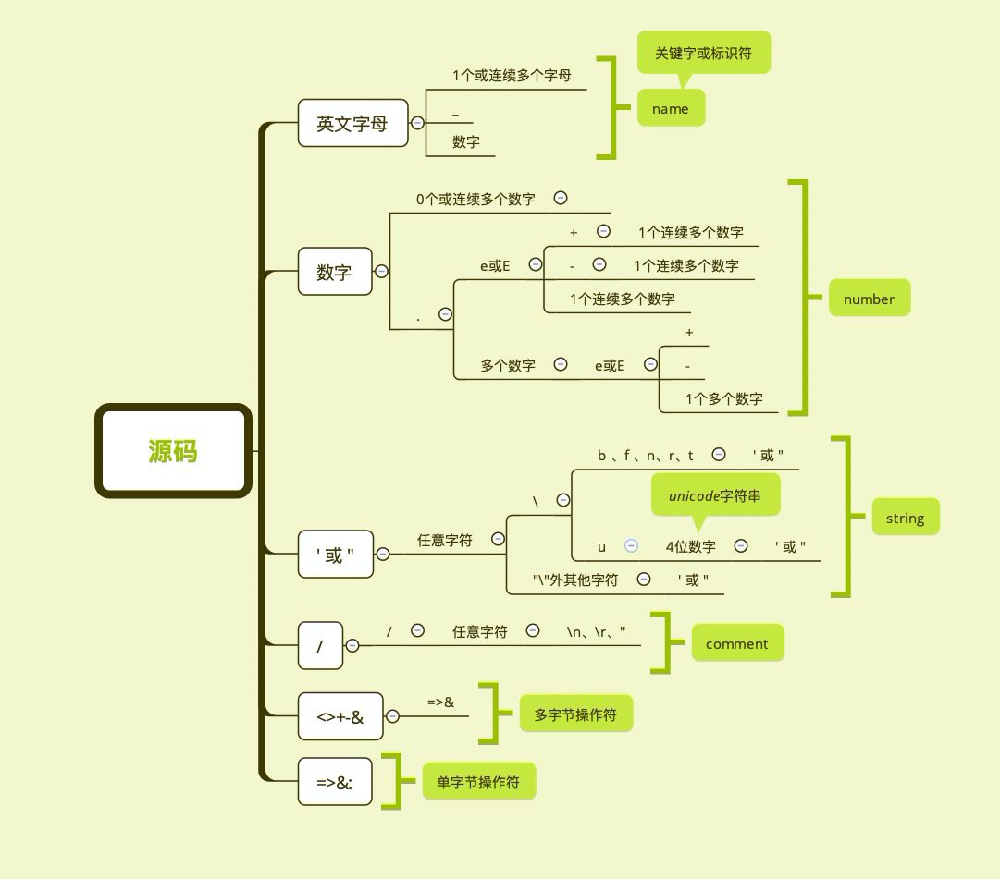

本文不会涉及文法、产生式、递归下降分析等理论知识，核心围绕Douglas Crockford关于TDOP讲解与实现进行思路梳理，来侧面辅助我们更好对Babel、TS、VUE模版编译等一系列前端编译期技术的理解。

```javascript
(function exprFn(){}) // ƒ exprFn(){}
{function stmtFn(){}} // undefined
```
当我们在chrome输入上面两行，chrome第一行输出 ƒ exprFn(){} ，第二行输出 undefined ，JS引擎是如何理解上面两行并作出不同输出的呢。
  
要回答这个问题，需要从JS引擎执行JS源码说起，实际上现代的JS引擎基本会运用JIT来优化JS脚本的执行速度，所以JS在某种程度也可以看作是一种编译语言。
   
在经典的编译原理中，会将编译器分为前端和后端。
   
前端：仅与编译的源代码相关

- 词法分析(Token)
- 语法分析(Parser)
- 语义分析

后端：和目标语言相关

- 字节码
- 目标代码

抽离两部分是为了方便一种源代码在不同目标语言上的实现，在编译器前端部分已经完成此种语言的语法、语义的定义，所以我们要回答开头的那个问题只需关注JS编译器的前端即可。


本系列文，我将尝试（挖坑）实现一个简单的JS编译器前端来解析、理解` var a = '1+1' `，并回答undefined代表什么
## 词法分析
词法分析将源码按我们定义的编程语言规则进行分词，它输出tokens作为语法分析的输入

`source code --> tokens --> parser --> ast`

如何从源代码识别出一个个"词法单元"呢？只要按照*词法单元的定义*尽可能多的消费掉源码即可识别出一个词法单元。
下面来看看这个简单JS引擎的词法定义


这里举个例子说明，如果有这样一段源码

```javascript
var val = 1 + 2 * 3
```

- 忽略掉源码中的空格然后从源码字符流中逐字符分析
- 遇到'v'，根据上图按"英文字母"的定义尽可能的消费掉源码，即可获得第一个*词法单元* `var`，类型为 *name*（标识符或关键字）。
- 然后从const后的下一个非空字符开始，遇到'v',获得下一个*词法单元* `val`，类型为 *name*（标识符或关键字）。
- 继续，遇到 "=" 根据 ` '<>+-&', '=>&:' ` ,获得第三个*词法单元* `=`，类型为 *operator*


我们可以根据词法定义构建有穷状态机来解出tokens，但是有穷自动机需要大量的回溯，所以我们既不自己构建有穷状态机也不使用正则，而是通过根据词法定义简单的分析字符串流的方式来拆解出tokens
上面这个例子最终会生成这样的tokens结果

```json
[
  {"type":"name","value":"const","from":7,"to":12},
  {"type":"name","value":"a","from":13,"to":14},
  {"type":"operator","value":"=","from":15,"to":16},
  {"type":"number","value":1,"from":17,"to":18},
  {"type":"operator","value":"+","from":19,"to":20},
  {"type":"number","value":2,"from":21,"to":22},
  {"type":"operator","value":"*","from":23,"to":24},
  {"type":"number","value":3,"from":25,"to":26},
]
```


## 构建AST
在有了tokens流后，如何进行语法和语义分析正确计算出1+2*3的结果并且将此表达式返回值赋值给val？
```javascript
var val = 1 + 2 * 3
```
还是上面的例子，如果能解析成下图的树结构，并且自底向上归并，根据token的类型和具体值进行相应响应，便可计算出1+2*3的值并且正确赋值给当前作用域的val


> 非真正ast结构

上图ast的json表示
```json
{
    "value": "=",
    "arity": "binary",
    "first": {
        "value": "a",
        "arity": "name"
    },
    "second": {
        "value": "+",
        "arity": "binary",
        "first": {
            "value": 1,
            "arity": "literal"
        },
        "second": {
            "value": "*",
            "arity": "binary",
            "first": {
                "value": 2,
                "arity": "literal"
            },
            "second": {
                 "value": 3,
                 "arity": "literal"
             }
         }
     }
 }
```

当然这其中要解决很多难题
- 优先级：虽然人能一眼看出2要先和3想乘，但如何告诉计算机'2'这个操作数要被'*'吸引和3相乘而非和1相加呢？
- 作用域：`var a = b + 1 +3`,如何理解这个b
- 表达式、语句：真正的语言中并非简单的`1+2+3`这种表达式，还有复杂的语句块`if (window) { val = 'web'}`、`class BizClass {}`，这种该解析成什么样的AST？
- 操作符的二义性：如+，把他理解成"加法"还是"正数"？
- ...

### TDOP（Top Down Operator Precedence）
TDOP是一种高效、易于理解的构建AST的技术。TDOP通过比较算符优先级大小，自上而下的推导出AST。需要注意的是算符并不单指"运算符"，而是指文法中的终结符。    
如：` const ？ &&  +  =  { } . ` 等都是运算符。


## 参考
Douglas Crockford关于TDOP一个讲解和JS实现:https://github.com/douglascrockford/TDOP
