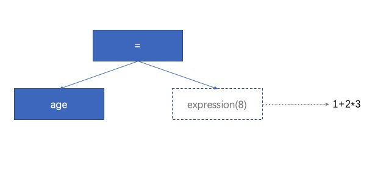

# 符号与表达式
## 符号
在[上一篇中](./01.词法和语法.md)解析出了词法单元，每种词法单元有不同的语法解析规则，所以需要一种数据结构(symbol)抽象*操作符*、*字面量*、*结束符*等词法单元不同解析逻辑。    
在TDOP中，TD代表自顶向下，OP代表算符优先：    
<font color="red">TD</font> 是从词法流开始位置作为解析起点，逐步遇到"符号"使用其对应的nud、led和bp（绑定权重）按照<font color="red">OP(算符优先)</font>优先级正确拆解其左右值
期间词法单元会逐步前进(advance)当解析完词法单元流后也就完成了语法校验和整个AST的生成。

如：
```javascript
const age = 1 + 2 * 3
```
对应的tokens

```
['const', 'age', '=' ,'1' ,'2' ,'*' , '3']
```

其中的算符

```
const、=、+、*
```

其中的左右值

```
age、1 、 2 、3
```


如果想最终转换为以下AST，很自然我们需要能够处理

- 不同的算符如何处理左右值：'='要去赋值、'+'要做加法
- 左右值该被哪个算符处理：如`age = 1 + 2 * 3`，'1' 既是'='的右值，又是'+'的左值，改如何知道它究竟作为谁的左右值呢？ 

```json
{
    "value": "=",
    "arity": "binary",
    "first": {
        "value": "val",
        "arity": "name"
    },
    "second": {
        "value": "+",
        "arity": "binary",
        "first": {
            "value": 1,
            "arity": "literal"
        },
        "second": {
            "value": "*",
            "arity": "binary",
            "first": {
                "value": 2,
                "arity": "literal"
            },
            "second": {
                 "value": 3,
                 "arity": "literal"
             }
         }
     }
 }
```
上面这个AST是如何解析出来的呢？我们将用本章剩余篇幅解答这个问题。


> 符号表用来存放定义符号的数据结构。


#### 符号
```javascript
var original_symbol = {
    nud: function () {
        this.error("Undefined.");
    },
    led: function (ignore) {
        this.error("Missing operator.");
    }
};
var symbol = function (id, bp) {
    var s = symbol_table[id];
    bp = bp || 0;
    if (s) {
        if (bp >= s.lbp) {
            s.lbp = bp;
        }
    } else {
        s = Object.create(original_symbol);
        s.id = id;
        s.value = id;
        s.lbp = bp;
        symbol_table[id] = s; // 放到符号表中
    }
    return s;
};
```

我们关注symbol最重要的三要素：nud、led、bp。      

- nud(空判定符)：关注如何解析词法单元右值，所以用于变量、字面量和前缀操作符，如解析语法：`-1`、`const age`

**字面量的nud方法**：
```javascript
var constant = function (s, v) {
    var x = symbol(s);
    x.nud = function () {
        this.value = symbol_table[this.id].value;
        this.arity = "literal";
        return this;
    };
    x.value = v;
    return x;
};
```

- led(判定符)：关注如何解析词法单元的左值，所以用于中缀和后缀表达式，如解析语法：`const age = 1+2*3`中的=

**=的led方法**：
```javascript
function assignmentLed(left) {
     if (left.id !== "." && left.id !== "[" && left.arity !== "name") {
         left.error("Bad lvalue.");
     }
     this.first = left;
     this.second = expression(9);
     this.assignment = true;
     this.arity = "binary";
     return this;
}
```

这里定义了赋值操作符左值只能如：`person.age`、`persion['age']`、`age`。
右值一定是表达式所以需要继续解析为最终全是终结符的子树。    
expression的参数(bp)代表:对**右值**的吸引力，值越大说明吸引力越大。   
拿这个例子说明，"="要小于"+" "+"要小于"*",所以<font color="red">expression一定是再去调用led的形成一个递归过程解析完整个表达式的过程</font>   


## TDOP之魂：expression
expression是TDOP最核心的枢纽部分，有了上面的理解理解expression方法就非常简单了

```javascript
var expression = function (rbp) {
    var left;
    var t = token;
    advance();
    left = t.nud();
    while (rbp < token.lbp) {
        t = token;
        advance();
        left = t.led(left);
    }
    return left;
};
```

上面的expression(8),从当前解析到的token开始[1,+,2,*,3]
- 记录当前token
- advance前进到下一个token
- 当前操作符的左绑定权重比表达式的右绑定权重大，那么应该由先当前操作符的led方法处理左值，如此递归下去直到处理完这个表达式


