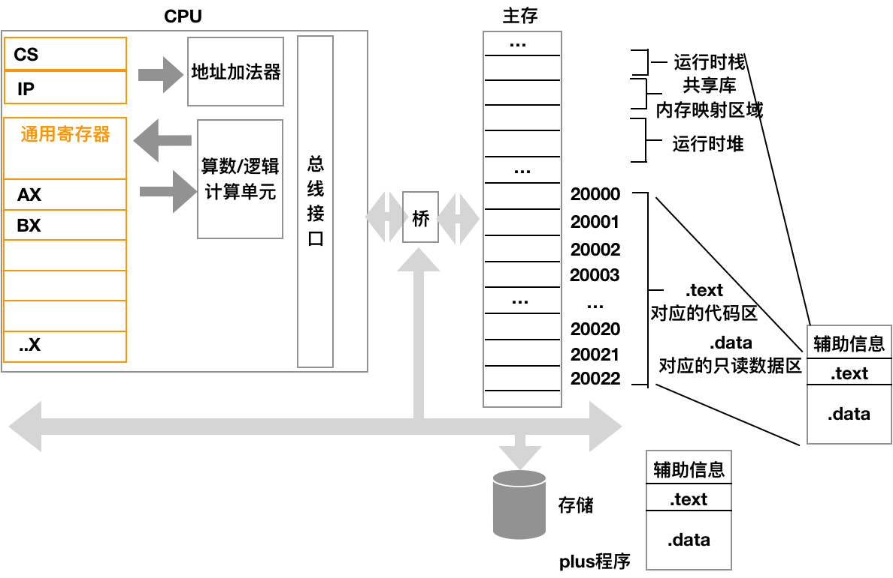

# 虚拟机（一）
当我们有了 AST 后，我们就有了多种选择来决定如何执行 AST 。
- 一种办法是编写解释器来对 AST 求值
- 二来可以将 AST 翻译成一个自定义的字节码，用我们自定义的虚拟机来执行
- 三来可以将 AST 直接翻译成不同机器的机器码

这里让我们看看虚拟机的办法，首先我们先来了解什么是虚拟机？虚拟机的本质是用软件来模拟计算机的执行过程，所以想要了解虚拟机需要先了解计算机大致是如何工作的。
## 物理机和操作系统
现在假设我们有一个名为 plus 的可执行文件，它的源码如下，让我们看看它是怎么run起来的呢？
```
function main() {
    return 19 + 3;
}
```

对应的汇编指令假设如下：
```
mov ax,013H
mov bx,003H
add ax,bx
```
对应的机器码
`BB 23 01 BB 03 00 89 D8 01 D8`

经过链接后，让其变为可执行文件，它的大概形如：         
     
当我们键入这个可执行文件时，操作系统会先用*装载器*加载程序，并在合适的时机以进程的形式将其调度到内存中为其分配资源：

- 根据"辅助信息"【操作系统进行系统调用】为进程分配设一定的运行时栈，来追踪函数调用、函数参数、局部变量、返回值等
- 根据"辅助信息"【操作系统进行系统调用】为进程分配一定的堆内存，来存放运行时动态分配的数据
- 【操作系统进行系统调用】根据虚拟内存布局将19、3其放入实际的内存空间
- 【操作系统进行系统调用】将指令放入实际的内存空间
当操作系统发现进程可以开始执行时：    
- 【操作系统请求系统调用】把 CS:IP 指向 plus 的第一个指令所处的实际内存位置 

CPU的定时时钟执行：
- 【CPU】CS:IP对应的内存地址中拿出这个指令，并且译指为mov   
- 【CPU】执行 mov 指令将立即数 013H 装入通用寄存器    
- 【CPU】循环，进入下一个 mov 和 add




这里我们要分清物理机和操作系统分别干的事，我们看到物理机干的事相当简单
- 根据 CS:IP 取指
- 解析指令
- 执行指令

所以当我们实现自己的虚拟机时我们应该有以下组成部分：
- 定义：一套自定义指令集
- 实现：一套寄存器，来存放数据和状态
- 实现：一个运行栈来根据维护函数调用和返回
- 实现：一个循环，一直来取指和执行


如果我们愿意，我们完全可以在JS的环境中写一个虚拟机来执行这段机器码。
JS的的代码
```
const stack = [];
const ops = [];
const = pc;

const p = loader(`BB 23 01 BB 03 00 89 D8 01 D8`)
const op = p[pc];
while(op) {
    swich(op) {
        case 'BB': // mov 
            pop(p.nextOperaNumber);
        case 'D8': // add
            stack.push(stack.pop() + stack.pop());
            
    }
    pc = op.nextOp;
}
```


